# Morning FM — คู่มือการใช้งาน / Hướng dẫn sử dụng / User Manual

**แอปพลิเคชัน / Ứng dụng / Application:** Morning FM (Srisawad Corporation Plc.)
**URL:** https://arunsawad-vn-project.web.app
**เวอร์ชัน / Phiên bản / Version:** 1.0.0 (build 38)
**วันที่จัดทำ / Ngày lập / Date:** 2026-07-23

---

## เกี่ยวกับเอกสารนี้ / Về tài liệu này / About this document

**🇹🇭 ไทย** — คู่มือนี้อธิบายทุกหน้าจอที่ผู้ใช้งานทั่วไปเข้าถึงได้ในแอป Morning FM ภาพหน้าจอทั้งหมดถ่ายจากระบบจริง โดยแสดงผลเป็น**ภาษาเวียดนาม** ซึ่งเป็นภาษาที่ผู้ใช้งานในเวียดนามเห็นจริง ส่วนคำอธิบายมีครบ 3 ภาษา หากต้องการเปลี่ยนภาษาในแอป ดูหัวข้อที่ 16

**🇻🇳 Tiếng Việt** — Tài liệu này mô tả tất cả màn hình mà người dùng thông thường có thể truy cập trong ứng dụng Morning FM. Ảnh chụp màn hình được lấy từ hệ thống thật, hiển thị bằng **tiếng Việt**. Phần giải thích có đủ 3 ngôn ngữ. Để đổi ngôn ngữ, xem mục 16.

**🇬🇧 English** — This manual documents every screen a normal user can reach in the Morning FM app. All screenshots are taken from the live system and display in **Vietnamese**, the language real users see. Explanations are given in all three languages. To change the app language, see section 16.

### สัญลักษณ์ / Ký hiệu / Annotation key

ตัวเลข **(1)** **(2)** **(3)** ในภาพตรงกับคำอธิบายด้านล่างของแต่ละภาพ
Các số **(1)** **(2)** **(3)** trên ảnh tương ứng với phần giải thích bên dưới.
The numbers **(1)** **(2)** **(3)** on each image match the explanations below it.

---

## 1. เข้าสู่ระบบ / Đăng nhập / Login

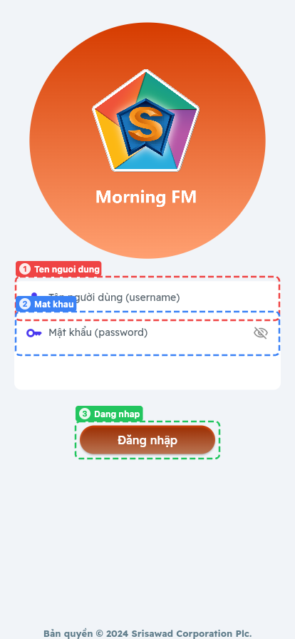

| | |
|---|---|
| **(1)** | **🇹🇭** ชื่อผู้ใช้ = รหัสพนักงาน (เช่น 23365) · **🇻🇳** Tên người dùng = mã nhân viên · **🇬🇧** Username = employee ID |
| **(2)** | **🇹🇭** รหัสผ่าน กดรูปตาเพื่อดูรหัส · **🇻🇳** Mật khẩu, nhấn biểu tượng mắt để xem · **🇬🇧** Password, tap the eye icon to reveal |
| **(3)** | **🇹🇭** ปุ่ม "Đăng nhập" เพื่อเข้าสู่ระบบ · **🇻🇳** Nhấn "Đăng nhập" · **🇬🇧** Tap "Đăng nhập" to sign in |

**🇹🇭** เข้าสู่ระบบครั้งแรกจะไปหน้าตั้งรหัส PIN · **🇻🇳** Lần đầu đăng nhập sẽ chuyển sang màn hình đặt mã PIN · **🇬🇧** First login goes to the Set PIN screen.

---

## 2. ตั้งรหัส PIN / Đặt mã PIN / Set PIN

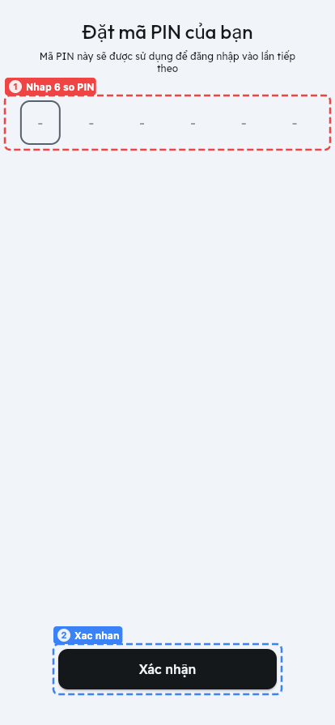

| | |
|---|---|
| **(1)** | **🇹🇭** ใส่รหัส PIN 6 หลัก (ตัวเลขเท่านั้น) · **🇻🇳** Nhập mã PIN 6 chữ số (chỉ số) · **🇬🇧** Enter a 6-digit numeric PIN |
| **(2)** | **🇹🇭** กด "Xác nhận" เพื่อบันทึก · **🇻🇳** Nhấn "Xác nhận" để lưu · **🇬🇧** Tap "Xác nhận" to save |

**🇹🇭** PIN นี้ใช้สำหรับเข้าแอปครั้งถัดไป · **🇻🇳** Mã PIN này dùng để đăng nhập lần sau · **🇬🇧** This PIN is used for subsequent logins.

---

## 3. ใส่รหัส PIN / Nhập mã PIN / Enter PIN

| | |
|---|---|
| **(1)** | **🇹🇭** "Logout" ออกจากระบบ กลับไปหน้าเข้าสู่ระบบ · **🇻🇳** "Logout" đăng xuất, quay lại màn hình đăng nhập · **🇬🇧** "Logout" signs out back to login |
| **(2)** | **🇹🇭** "Clear Cache" ล้างข้อมูลชั่วคราวของแอป · **🇻🇳** "Clear Cache" xóa bộ nhớ tạm · **🇬🇧** "Clear Cache" clears cached app data |
| **(3)** | **🇹🇭** ใส่ PIN 6 หลักที่ตั้งไว้ · **🇻🇳** Nhập mã PIN 6 số đã đặt · **🇬🇧** Enter your 6-digit PIN |

**🇹🇭** ถ้าใส่ PIN ผิด ระบบจะแจ้ง "รหัส PIN ไม่ถูกต้อง กรุณาลองใหม่อีกครั้ง"
**🇻🇳** Nếu sai, hệ thống báo "mã pin không hợp lệ Vui lòng thử lại."
**🇬🇧** A wrong PIN shows "Invalid PIN. Please try again."

---

## 4. หน้าหลัก / Trang chủ / Home

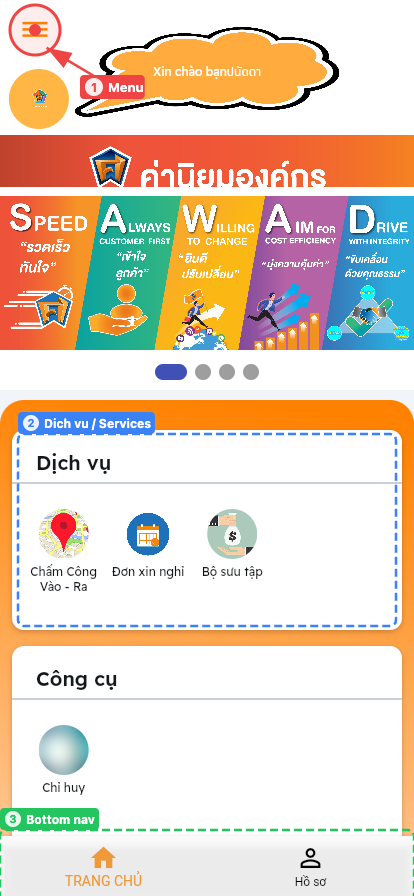

| | |
|---|---|
| **(1)** | **🇹🇭** ปุ่มเมนู เปิดแถบเมนูด้านข้าง (ดูหัวข้อ 15) · **🇻🇳** Nút menu, mở thanh bên (mục 15) · **🇬🇧** Menu button, opens the side drawer (section 15) |
| **(2)** | **🇹🇭** กลุ่ม "Dịch vụ" (บริการ) รวมฟังก์ชันหลัก · **🇻🇳** Nhóm "Dịch vụ" chứa các chức năng chính · **🇬🇧** The "Dịch vụ" (Services) group holds the main functions |
| **(3)** | **🇹🇭** แถบล่าง: TRANG CHỦ (หน้าหลัก) และ Hồ sơ (โปรไฟล์) · **🇻🇳** Thanh dưới: TRANG CHỦ và Hồ sơ · **🇬🇧** Bottom nav: Home and Profile |

**🇹🇭** ด้านบนแสดงคำทักทายพร้อมชื่อผู้ใช้ และแบนเนอร์ค่านิยมองค์กร (SPEED)
**🇻🇳** Phía trên hiển thị lời chào kèm tên người dùng và banner giá trị cốt lõi (SPEED).
**🇬🇧** The top shows a greeting with your name and the corporate-values banner (SPEED).

---

## 5. บริการทั้งหมด / Các dịch vụ / Services

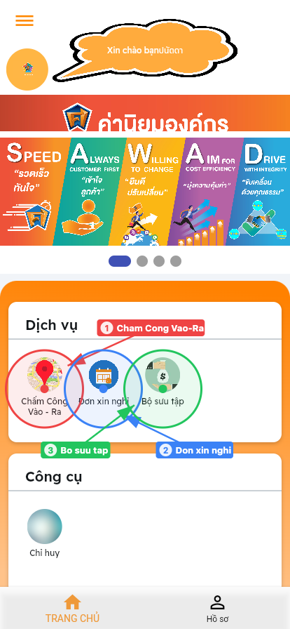

| | |
|---|---|
| **(1)** | **🇹🇭** "Chấm Công Vào - Ra" = ลงเวลาเข้า-ออกงาน · **🇻🇳** Chấm công vào ra · **🇬🇧** Check in / check out |
| **(2)** | **🇹🇭** "Đơn xin nghỉ" = ใบลา · **🇻🇳** Đơn xin nghỉ phép · **🇬🇧** Leave request |
| **(3)** | **🇹🇭** "Bộ sưu tập" = งานติดตามหนี้ (Collection) · **🇻🇳** Bộ sưu tập (thu hồi nợ) · **🇬🇧** Collection (debt recovery) |

**🇹🇭** กลุ่ม "Công cụ" ด้านล่างมีเมนู "Chỉ huy" ซึ่งเปิดเครื่องมือติดตามในหน้าต่างใหม่
**🇻🇳** Nhóm "Công cụ" bên dưới có "Chỉ huy", mở công cụ theo dõi trong cửa sổ mới.
**🇬🇧** The "Công cụ" (Tools) group below contains "Chỉ huy", which opens the tracking tool in a new window.

---

## 6. เมนูลงเวลา / Menu chấm công / Check-in menu

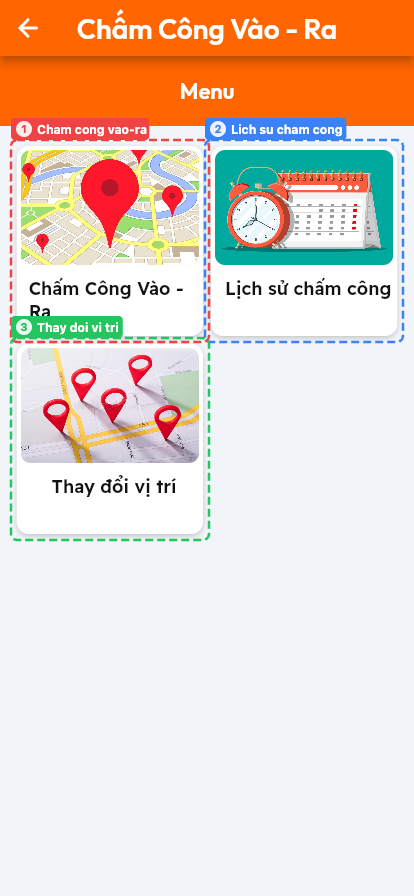

| | |
|---|---|
| **(1)** | **🇹🇭** "Chấm Công Vào - Ra" ลงเวลาเข้า-ออก · **🇻🇳** Chấm công vào - ra · **🇬🇧** Check in / out |
| **(2)** | **🇹🇭** "Lịch sử chấm công" ประวัติการลงเวลา · **🇻🇳** Lịch sử chấm công · **🇬🇧** Check-in history |
| **(3)** | **🇹🇭** "Thay đổi vị trí" แก้ไขพิกัดสาขา · **🇻🇳** Thay đổi vị trí chi nhánh · **🇬🇧** Change branch location |

---

## 7. ลงเวลาเข้า-ออกงาน / Chấm công / Check in – out

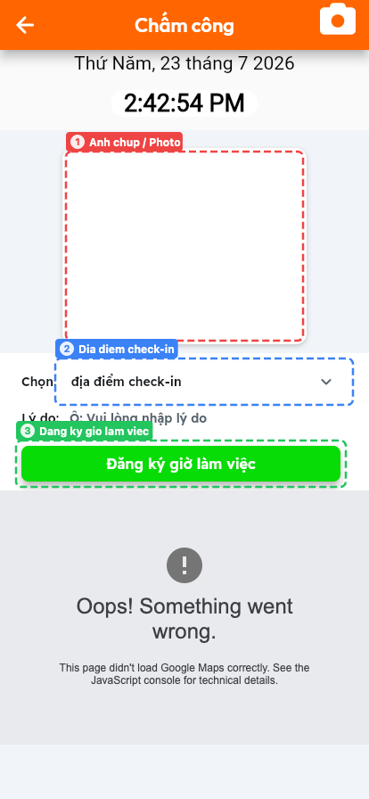

| | |
|---|---|
| **(1)** | **🇹🇭** กรอบรูปถ่าย กดไอคอนกล้องมุมขวาบนเพื่อถ่ายรูป · **🇻🇳** Khung ảnh, nhấn biểu tượng máy ảnh góc trên bên phải · **🇬🇧** Photo frame; use the camera icon at top right |
| **(2)** | **🇹🇭** "Chọn: địa điểm check-in" เลือกสถานที่ลงเวลา · **🇻🇳** Chọn địa điểm check-in · **🇬🇧** Select the check-in location |
| **(3)** | **🇹🇭** ปุ่ม "Đăng ký giờ làm việc" ยืนยันการลงเวลา · **🇻🇳** Nhấn "Đăng ký giờ làm việc" · **🇬🇧** Tap "Đăng ký giờ làm việc" to submit |

**🇹🇭** ด้านบนแสดงวันที่และเวลาปัจจุบัน · ช่อง "Lý do" ใช้กรอกเหตุผลเมื่อจำเป็น
**🇻🇳** Phía trên hiển thị ngày và giờ hiện tại; ô "Lý do" để nhập lý do khi cần.
**🇬🇧** The top shows the current date and time; the "Lý do" field is for a reason when required.

> **⚠️ หมายเหตุ / Lưu ý / Note**
> **🇹🇭** บนเว็บ แผนที่ด้านล่างแสดงข้อผิดพลาด "Oops! Something went wrong" (ดูภาคผนวก ก.1)
> **🇻🇳** Trên bản web, bản đồ bên dưới báo lỗi "Oops! Something went wrong" (xem Phụ lục A.1).
> **🇬🇧** On the web build the map below shows "Oops! Something went wrong" (see Appendix A.1).

---

## 8. ประวัติการลงเวลา / Lịch sử chấm công / Check-in history

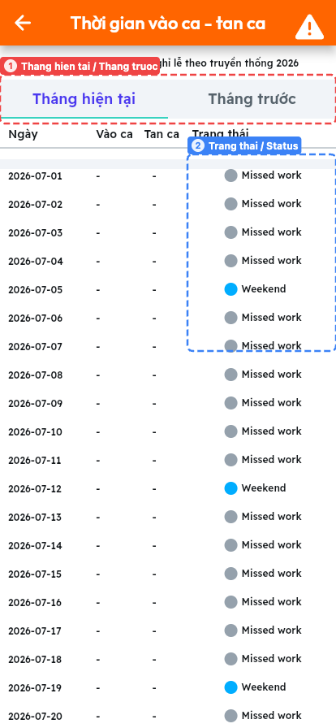

| | |
|---|---|
| **(1)** | **🇹🇭** แท็บ "Tháng hiện tại" (เดือนปัจจุบัน) / "Tháng trước" (เดือนก่อน) · **🇻🇳** Tab tháng hiện tại / tháng trước · **🇬🇧** Current month / previous month tabs |
| **(2)** | **🇹🇭** คอลัมน์ "Trạng thái" สถานะแต่ละวัน · **🇻🇳** Cột "Trạng thái" · **🇬🇧** The "Trạng thái" (Status) column |

**คอลัมน์ / Các cột / Columns:** `Ngày` = วันที่ / ngày / date · `Vào ca` = เข้างาน / giờ vào / clock-in · `Tan ca` = เลิกงาน / giờ ra / clock-out · `Trạng thái` = สถานะ / trạng thái / status

**สถานะ / Trạng thái / Status:** `Missed work` = ขาดงาน / nghỉ làm / absent · `Weekend` = วันหยุดสุดสัปดาห์ / cuối tuần / weekend

---

## 9. เมนูการลา / Menu nghỉ phép / Leave menu

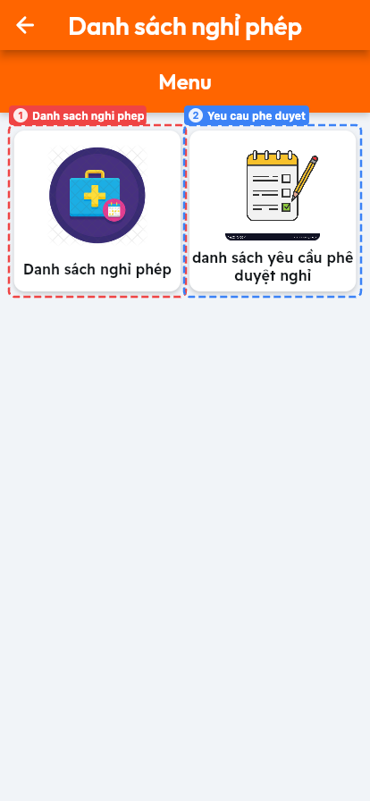

| | |
|---|---|
| **(1)** | **🇹🇭** "Danh sách nghỉ phép" รายการสิทธิ์วันลา · **🇻🇳** Danh sách nghỉ phép · **🇬🇧** Leave entitlement list |
| **(2)** | **🇹🇭** "danh sách yêu cầu phê duyệt nghỉ" รายการคำขออนุมัติ · **🇻🇳** Danh sách yêu cầu phê duyệt · **🇬🇧** Approval request list |

---

## 10. ประเภทวันลาและสิทธิ์คงเหลือ / Loại nghỉ phép / Leave types and balance

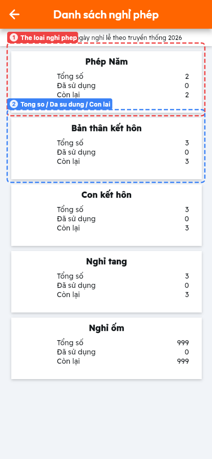

| | |
|---|---|
| **(1)** | **🇹🇭** การ์ดแต่ละใบคือประเภทการลา กดเพื่อยื่นใบลา · **🇻🇳** Mỗi thẻ là một loại nghỉ phép, nhấn để tạo đơn · **🇬🇧** Each card is a leave type; tap it to file a request |
| **(2)** | **🇹🇭** ตัวเลขสิทธิ์วันลาของประเภทนั้น · **🇻🇳** Số ngày phép của loại đó · **🇬🇧** The day balance for that type |

**ความหมายตัวเลข / Ý nghĩa các số / Number meanings**
`Tổng số` = สิทธิ์ทั้งหมด / tổng số ngày / total · `Đã sử dụng` = ใช้ไปแล้ว / đã dùng / used · `Còn lại` = คงเหลือ / còn lại / remaining

**ประเภทการลา / Các loại nghỉ phép / Leave types**

| Tiếng Việt | ไทย | English |
|---|---|---|
| Phép Năm | ลาพักร้อน | Annual leave |
| Bản thân kết hôn | ลาแต่งงานของตนเอง | Own marriage leave |
| Con kết hôn | ลาแต่งงานของบุตร | Child's marriage leave |
| Nghỉ tang | ลางานศพ | Bereavement leave |
| Nghỉ ốm | ลาป่วย | Sick leave |

---

## 11. ยื่นใบลา / Gửi yêu cầu phê duyệt / Submit a leave request

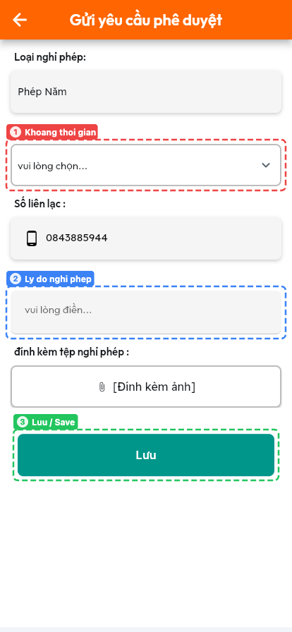

| | |
|---|---|
| **(1)** | **🇹🇭** "Khoảng thời gian" เลือกช่วงวันที่ลา · **🇻🇳** Chọn khoảng thời gian nghỉ · **🇬🇧** Select the leave date range |
| **(2)** | **🇹🇭** "Lý do nghỉ phép" กรอกเหตุผลการลา · **🇻🇳** Nhập lý do nghỉ phép · **🇬🇧** Enter the reason for leave |
| **(3)** | **🇹🇭** ปุ่ม "Lưu" บันทึกและส่งคำขอ · **🇻🇳** Nhấn "Lưu" để gửi đơn · **🇬🇧** Tap "Lưu" to save and submit |

**ช่องอื่น ๆ / Các trường khác / Other fields**
`Loại nghỉ phép` = ประเภทการลา (เลือกมาจากหน้าก่อน) / loại nghỉ / leave type (carried from the previous screen)
`Số liên lạc` = เบอร์ติดต่อ / số liên lạc / contact number
`đính kèm tệp nghỉ phép` = แนบไฟล์/รูปประกอบ / đính kèm ảnh / attach a file or photo

---

## 12. รายการคำขออนุมัติ / Danh sách yêu cầu phê duyệt / Approval list

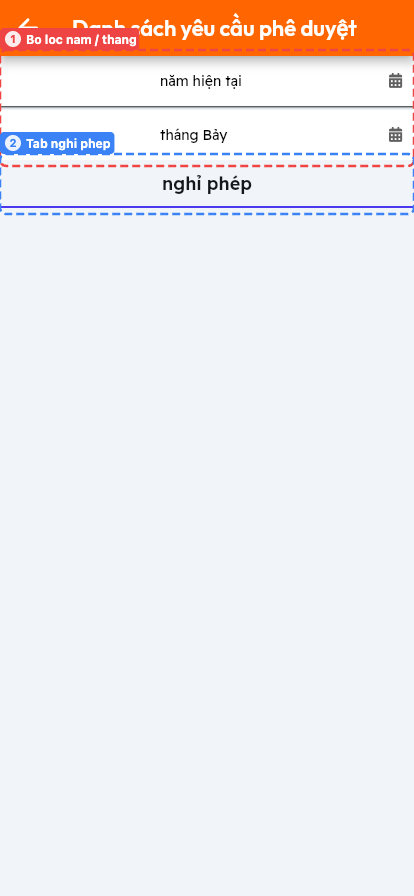

| | |
|---|---|
| **(1)** | **🇹🇭** ตัวกรองปี ("năm hiện tại") และเดือน ("tháng Bảy") · **🇻🇳** Bộ lọc năm và tháng · **🇬🇧** Year and month filters |
| **(2)** | **🇹🇭** แท็บ "nghỉ phép" แสดงรายการใบลา · **🇻🇳** Tab "nghỉ phép" hiển thị danh sách đơn · **🇬🇧** The "nghỉ phép" tab lists leave requests |

**🇹🇭** ในภาพไม่มีรายการ เพราะบัญชีตัวอย่างยังไม่มีใบลาในเดือนที่เลือก
**🇻🇳** Ảnh không có dữ liệu vì tài khoản mẫu chưa có đơn trong tháng đã chọn.
**🇬🇧** The list is empty here because the sample account has no requests in the selected month.

---

## 13. งานติดตามหนี้ / Bộ sưu tập / Collection

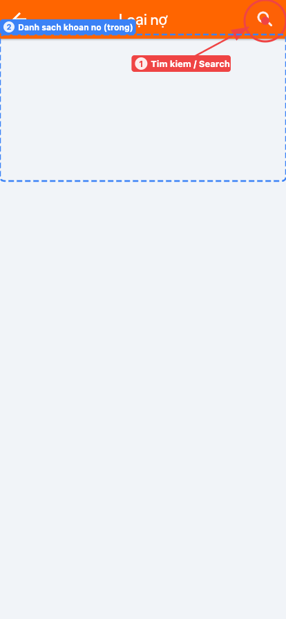

| | |
|---|---|
| **(1)** | **🇹🇭** ปุ่มค้นหารายการหนี้ · **🇻🇳** Nút tìm kiếm khoản nợ · **🇬🇧** Search for debt records |
| **(2)** | **🇹🇭** พื้นที่แสดงรายการ "Loại nợ" (ประเภทหนี้) · **🇻🇳** Khu vực danh sách "Loại nợ" · **🇬🇧** The "Loại nợ" (debt type) list area |

**🇹🇭** บัญชีตัวอย่างไม่มีสิทธิ์งาน Collection รายการจึงว่าง และมีข้อความแจ้งเตือน "-1" ก่อนเข้าหน้านี้
**🇻🇳** Tài khoản mẫu không có quyền Collection nên danh sách trống và hiện thông báo "-1" trước đó.
**🇬🇧** The sample account has no Collection role, so the list is empty and a "-1" dialog appears first.

---

## 14. โปรไฟล์ / Hồ sơ / Profile

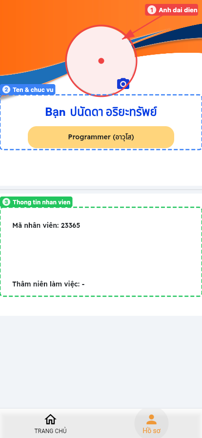

| | |
|---|---|
| **(1)** | **🇹🇭** รูปโปรไฟล์ กดไอคอนกล้องเพื่อเปลี่ยนรูป · **🇻🇳** Ảnh đại diện, nhấn biểu tượng máy ảnh để đổi · **🇬🇧** Profile photo; tap the camera icon to change it |
| **(2)** | **🇹🇭** ชื่อผู้ใช้และตำแหน่งงาน · **🇻🇳** Tên và chức vụ · **🇬🇧** Name and job title |
| **(3)** | **🇹🇭** ข้อมูลพนักงาน · **🇻🇳** Thông tin nhân viên · **🇬🇧** Employee details |

`Mã nhân viên` = รหัสพนักงาน / mã nhân viên / employee ID
`Thâm niên làm việc` = อายุงาน / thâm niên / length of service

---

## 15. เมนูด้านข้าง / Menu bên / Side drawer

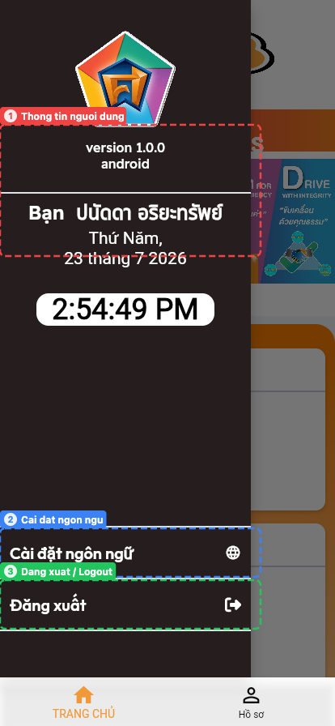

| | |
|---|---|
| **(1)** | **🇹🇭** เวอร์ชันแอป ชื่อผู้ใช้ วันที่และเวลาปัจจุบัน · **🇻🇳** Phiên bản, tên người dùng, ngày giờ · **🇬🇧** App version, user name, current date and time |
| **(2)** | **🇹🇭** "Cài đặt ngôn ngữ" ตั้งค่าภาษา (หัวข้อ 16) · **🇻🇳** Cài đặt ngôn ngữ (mục 16) · **🇬🇧** Language settings (section 16) |
| **(3)** | **🇹🇭** "Đăng xuất" ออกจากระบบ · **🇻🇳** Đăng xuất · **🇬🇧** Log out |

---

## 16. ตั้งค่าภาษา / Cài đặt ngôn ngữ / Language settings

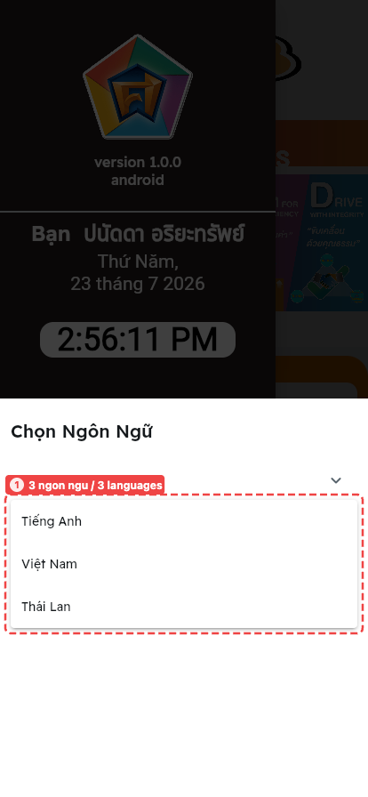

| | |
|---|---|
| **(1)** | **🇹🇭** เลือกได้ 3 ภาษา · **🇻🇳** Có 3 ngôn ngữ · **🇬🇧** Three languages available |

| ตัวเลือกในแอป | ภาษา | Ngôn ngữ | Language |
|---|---|---|---|
| Tiếng Anh | อังกฤษ | Tiếng Anh | English |
| Việt Nam | เวียดนาม | Tiếng Việt | Vietnamese |
| Thái Lan | ไทย | Tiếng Thái | Thai |

**วิธีใช้ / Cách dùng / How to use**
**🇹🇭** เปิดเมนูด้านข้าง → "Cài đặt ngôn ngữ" → เลือกภาษาจากรายการ → กด "Áp dụng"
**🇻🇳** Mở menu bên → "Cài đặt ngôn ngữ" → chọn ngôn ngữ → nhấn "Áp dụng".
**🇬🇧** Open the side drawer → "Cài đặt ngôn ngữ" → pick a language → tap "Áp dụng".

---

## 17. เปลี่ยนพิกัดสาขา / Thay đổi vị trí / Change branch location

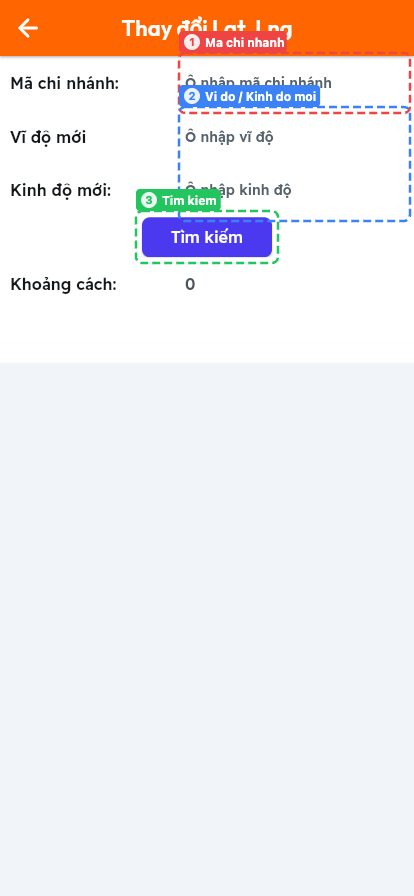

| | |
|---|---|
| **(1)** | **🇹🇭** "Mã chi nhánh" รหัสสาขา · **🇻🇳** Mã chi nhánh · **🇬🇧** Branch code |
| **(2)** | **🇹🇭** "Vĩ độ mới" ละติจูดใหม่ และ "Kinh độ mới" ลองจิจูดใหม่ · **🇻🇳** Vĩ độ mới và kinh độ mới · **🇬🇧** New latitude and new longitude |
| **(3)** | **🇹🇭** ปุ่ม "Tìm kiếm" ค้นหา/ยืนยัน · **🇻🇳** Nhấn "Tìm kiếm" · **🇬🇧** Tap "Tìm kiếm" to search |

`Khoảng cách` = ระยะห่าง / khoảng cách / distance

---

## ภาคผนวก ก — ปัญหาที่พบ / Phụ lục A — Vấn đề đã biết / Appendix A — Known issues

**🇹🇭** ปัญหาต่อไปนี้พบระหว่างจัดทำคู่มือ บนเวอร์ชันเว็บ (2026-07-23)
**🇻🇳** Các vấn đề sau được phát hiện khi lập tài liệu, trên bản web (23-07-2026).
**🇬🇧** The following were observed while producing this manual, on the web build (2026-07-23).

### ก.1 แผนที่ไม่แสดงผล / Bản đồ không hiển thị / Map does not render

**🇹🇭** หน้าลงเวลาแสดง "Oops! Something went wrong" แทนแผนที่ สาเหตุคือ Maps JavaScript API ยังไม่ได้เปิดใช้งานใน Google Cloud project (`ApiNotActivatedMapError`)
**🇻🇳** Màn hình chấm công hiện "Oops! Something went wrong" thay vì bản đồ, do Maps JavaScript API chưa được bật (`ApiNotActivatedMapError`).
**🇬🇧** The check-in screen shows "Oops! Something went wrong" instead of a map because the Maps JavaScript API is not enabled for the project (`ApiNotActivatedMapError`).

### ก.2 หน้าใส่ PIN ค้างบนเว็บ / Màn hình PIN bị treo trên web / PIN screen hangs on web

**🇹🇭** หลังรีเฟรชหน้าเว็บ การใส่ PIN ที่ถูกต้องจะไม่ไปหน้าถัดไป เพราะโค้ดเรียก `Permission.locationAlways` ซึ่งไม่รองรับบนเว็บ (`lib/custom_code/actions/background_location_check.dart`)
**🇻🇳** Sau khi tải lại trang, nhập đúng mã PIN vẫn không chuyển trang do gọi `Permission.locationAlways` — không hỗ trợ trên web.
**🇬🇧** After a page reload, entering the correct PIN does not proceed, because the handler calls `Permission.locationAlways`, which Flutter web does not support.

### ก.3 หน้าที่เข้าไม่ถึง / Trang không truy cập được / Unreachable pages

**🇹🇭** `NotificationPage` (หน้าแจ้งเตือน) และ `GuideBookPage` (คู่มือในแอป) มีอยู่ในระบบเส้นทาง แต่ไม่มีปุ่มใดในแอปเปิดหน้าเหล่านี้ จึงไม่มีในคู่มือ
**🇻🇳** `NotificationPage` và `GuideBookPage` có trong định tuyến nhưng không có nút nào mở, nên không có trong tài liệu.
**🇬🇧** `NotificationPage` and `GuideBookPage` exist as routes but nothing in the app navigates to them, so they are not documented here.

### ก.4 ส่วนที่ไม่ได้บันทึกภาพ / Phần chưa ghi hình / Not captured

**🇹🇭** เมนู "Chỉ huy" (เครื่องมือติดตาม) เปิดหน้าต่างใหม่ที่ต้องใส่ PIN ซ้ำ จึงติดปัญหาข้อ ก.2 · ส่วน Collection และ Lead ต้องใช้บัญชีที่มีสิทธิ์ตรงกัน
**🇻🇳** "Chỉ huy" mở cửa sổ mới yêu cầu nhập lại PIN nên gặp vấn đề A.2; Collection và Lead cần tài khoản có quyền tương ứng.
**🇬🇧** "Chỉ huy" opens a new window that re-prompts for the PIN and therefore hits issue A.2; Collection and Lead need an account with the matching role.

---

*เอกสารนี้จัดทำจากระบบจริงเมื่อ 2026-07-23 / Tài liệu lập từ hệ thống thật ngày 23-07-2026 / Generated from the live system on 2026-07-23*
